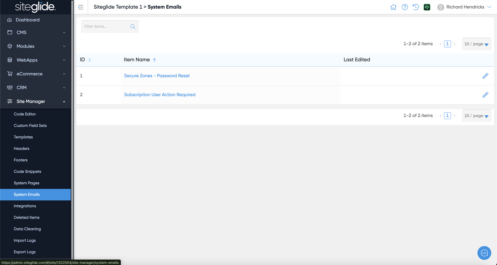
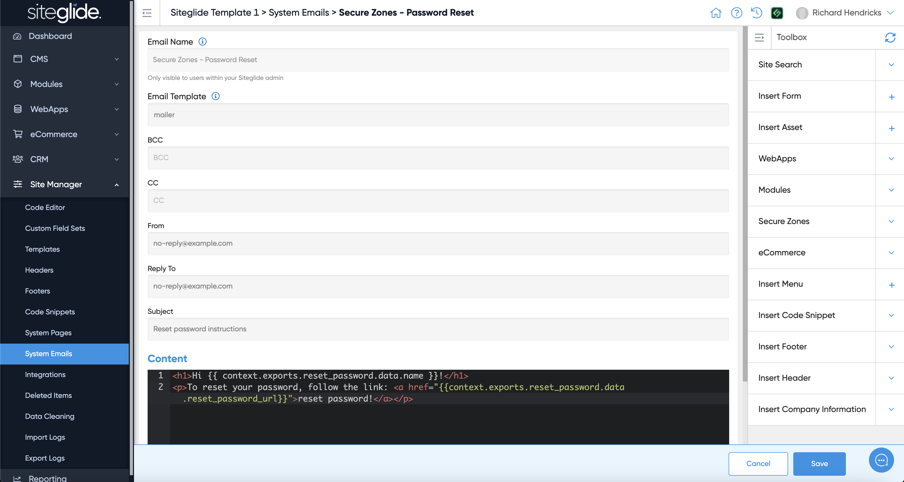

# System Emails

There are a couple of pre-built System Emails which help you manage Secure Zone Password Reset and Subscriptions:

<figure><figcaption></figcaption></figure>

You can edit each email in Admin and use Toolbox to insert Siteglide functionality or they can also be edited via CLI:

<figure><figcaption></figcaption></figure>
