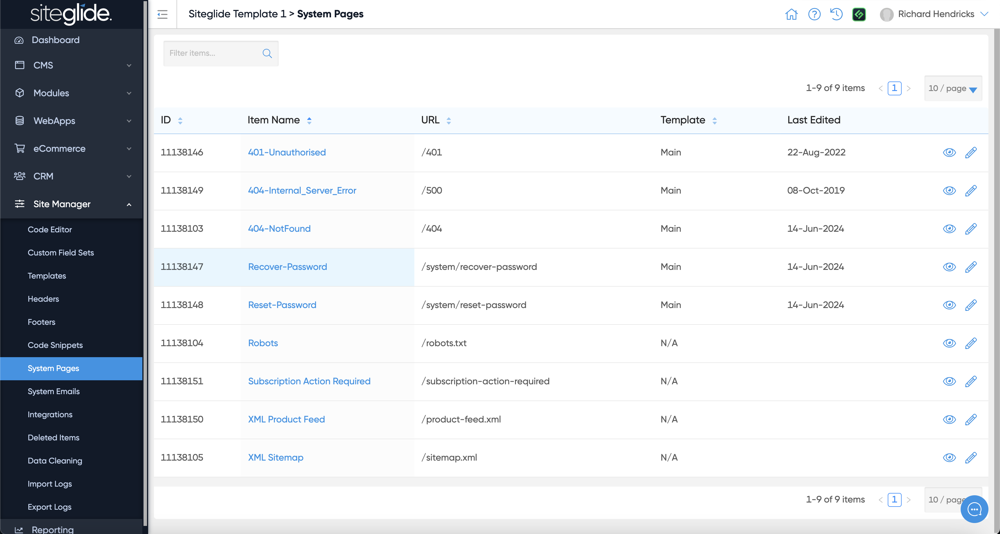
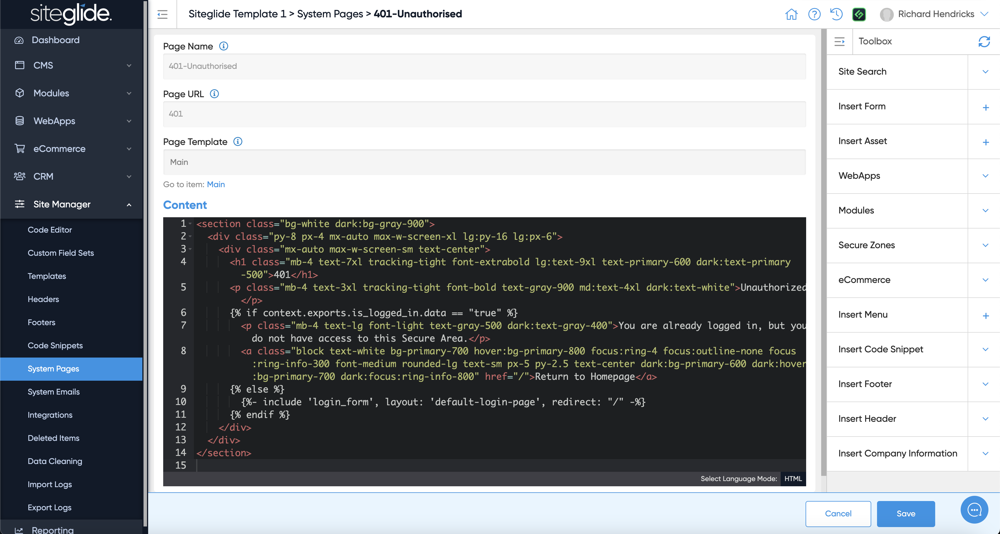

# System Pages

There are a number of pre-built System Pages which help you manage various processes in Siteglide including a 404 page, Robots.txt and an XML Sitemap:

<figure><figcaption></figcaption></figure>

You can edit each page in Admin and use Toolbox to insert Siteglide functionality or they can also be edited via CLI:

<figure><figcaption></figcaption></figure>
