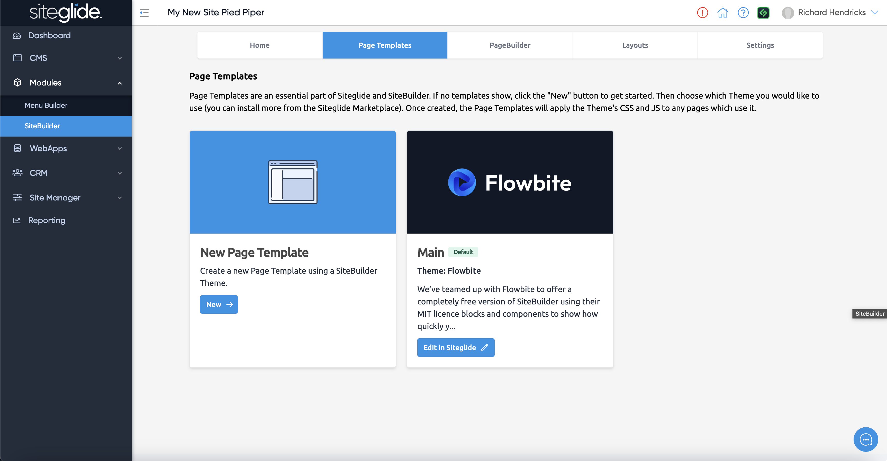

# 🚀 Quickstart: SiteBuilder

## What is SiteBuilder?

SiteBuilder is a tool to help you build better websites, faster.&#x20;

More information:


[about-sitebuilder.md](about-sitebuilder.md)


## Core Concepts

SiteBuilder offers 2 main things:

1. **Layouts:** Build out sites with ready-made, best-practice sections in just a few clicks
2. **Builder:** SiteBuilder will do the heavy lifting in Siteglide for you from a simple, intuitive UI

Sitebuilder does **NOT** limit what you can build, it's simply a starting point for rapid development that can then be completely customised.

## Where do I find SiteBuilder?


Skip if you already have a Site with SiteBuilder installed


You can start from Templates (recommended) or start from scratch by installing the Module to an existing Site:

<table data-card-size="large" data-column-title-hidden data-view="cards"><thead><tr><th></th><th></th><th data-hidden></th><th data-hidden data-card-target data-type="content-ref"></th><th data-hidden data-card-cover data-type="files"></th></tr></thead><tbody><tr><td><mark style="color:blue;">(Recommended)</mark></td><td><strong>Option 1:</strong> Create Site from Flowbite Template</td><td></td><td><a href="../../portal/sites/steps-to-create-your-first-site.md">steps-to-create-your-first-site.md</a></td><td><a href="../../.gitbook/assets/Siteglide-Marketplace-Template-Landing-Page-Modal.jpg">Siteglide-Marketplace-Template-Landing-Page-Modal.jpg</a></td></tr><tr><td>          </td><td><strong>Option 2:</strong> Install Module on Existing Site</td><td></td><td><a href="install-sitebuilder-module.md">install-sitebuilder-module.md</a></td><td><a href="../../.gitbook/assets/Siteglide-Site-Modules-SiteBuilder.jpg">Siteglide-Site-Modules-SiteBuilder.jpg</a></td></tr></tbody></table>

## Page Templates


You can skip this step if your site already has a Page Template (it will do if you used a Template)


A Page Template is an essential component, any of our Marketplace Templates will come with at least one already but you can create them here:


[create-a-page-template.md](create-a-page-template.md)


SiteBuilder simply leverages the Page Templates functionality in Siteglide but builds it for you with useful options to save you time.

<figure><figcaption></figcaption></figure>

## Pages

There are 2 ways to build Pages:

### PageBuilder
