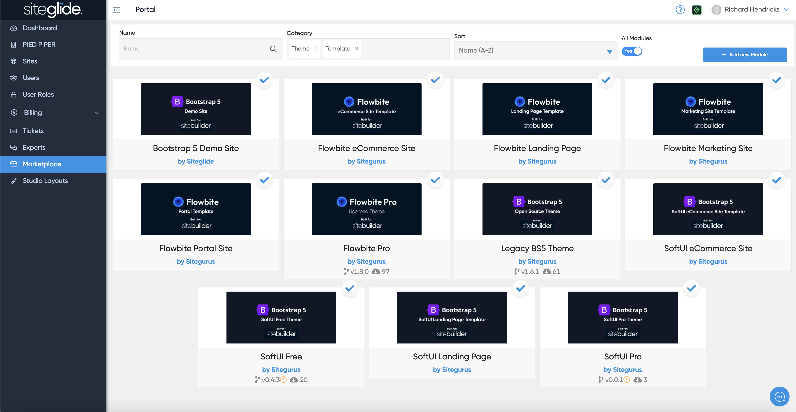

# ℹ️ Marketplace Themes & Templates

SiteBuilder Themes help you to find content for your site which uses a consistent CSS and JS framework.

A Theme becomes active when you create a Page Template in SiteBuilder using that Theme in the Page Templates tab.

<figure><figcaption></figcaption></figure>

### Choosing a Theme 

Each Theme will have a different combination of features:

* CSS or JavaScript Framework e.g. Bootstrap / Tailwind
* The selection of Modules supported
* The selection of Dynamic and Static Layouts available


We recommend using the Flowbite TailwindCSS Theme, SiteBuilder is setup to work best with Flowbite and you will find more layouts and features available for Flowbite than other Themes.


Take these into consideration and choose a Theme which is the best fit for your project.

More Themes are available on the Siteglide Marketplace. Any Themes which you decide not to use can be safely uninstalled from your Site, except for any that ship with the main SiteBuilder Module.

## SiteBuilder Marketplace Templates

Marketplace Templates help you get started quickly without having to build a site from scratch. Templates will generally be based on a specific Theme (Flowbite or Bootstrap5 typically).


Why not test it out by creating a site from a template?



[steps-to-create-your-first-site.md](../../../portal/sites/steps-to-create-your-first-site.md)

