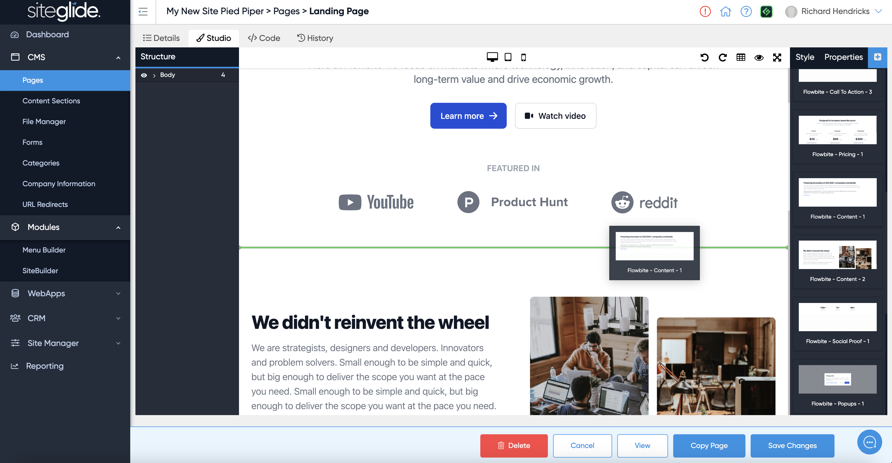

# 📋 Insert Static Layouts

Static Layouts are sections of pre-built HTML code that you can add to your pages in the Siteglide Admin. They do not generally contain any Liquid templating, so won't pull in any dynamic content from the server or CMS. Instead, you can use Siteglide's Studio tab to edit their content directly in the page.

## Insert Static Layouts from Studio Sidebar

Navigate to CMS > Pages, select a page and then from the right hand side bar you can click the blue button and insert various static layouts.

<figure><figcaption></figcaption></figure>

## Insert Static Layouts From Other Sources

You can essentially use any TailwindCSS Layouts or code blocks. A few ideas of how to extend beyond the Layouts you'll find in Studio:

[Flowbite website](https://flowbite.com/blocks/): Flowbite are constantly releasing new layouts that may not yet be available in Siteglide.

[Flowbite Chat GPT](https://chatgpt.com/g/g-y7yC35HB9-flowbite-gpt): Create your own AI generated layouts/sections in seconds!
