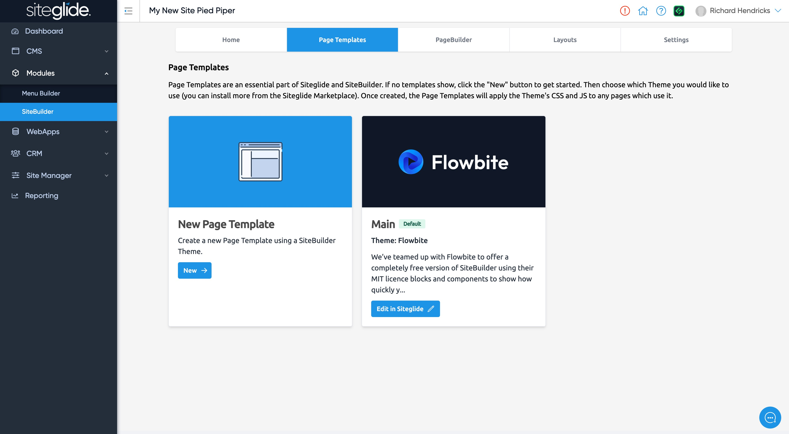

# 🏗️ Create a Page Template

A Page Template is an essential component, any of our Marketplace Templates will come with at least one already but you can create them here:

<figure><figcaption>
One template already exists (Main) but you can create more if needed
</figcaption></figure>

SiteBuilder simply leverages the Page Templates functionality in Siteglide but builds it for you with useful options to save you time.

In the popup, choose:

* A name e.g. "Main"
* Default Page Template - optional
* the Flowbite Theme (other SiteBuilder Themes will be available to download from Marketplace)
* Optionally, add a Menu, but this is not neccesary for this tutorial

Themes automatically add any of the following to a Page Template:

* CSS
* JavaScript
* Config Files
* Standard Page Template HTML and Liquid

These will then be applied consistently to any Page the Page Template is attached to.

Once created, you can find your template in the SiteBuilder Page Templates tab and in the Siteglide Admin under `SITE MANAGER > Templates`. These Page Templates are fully editable and you can attach them to Siteglide Pages as normal.

Once you've created a Page Template, you'll unlock the PageBuilder, Layouts and Settings tabs.


The Flowbite template starts with a default Tailwind CSS file which allows most layouts to work out of the box, but if you want to start changing things, you'll need to follow the rest of these setup steps!

