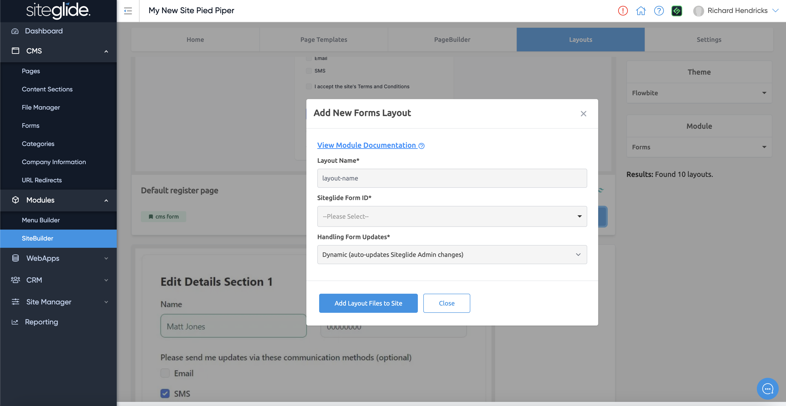

# 📋 Installing Dynamic Layouts


Looking for Static Layouts? They don't need to be installed, see: [static-layouts.md](about-sitebuilder/static-layouts.md "mention")


## Modules and Dynamic Layouts 

More info on Dynamic Layouts:


[dynamic-layouts-in-sitebuilder.md](about-sitebuilder/dynamic-layouts-in-sitebuilder.md)


Once you've installed a Page Template, the other tabs will be available including the Layouts tab. Here you can toggle the Module on the right hand side and view all the different dynamic layouts available.

<figure><figcaption></figcaption></figure>

When you find a layout you want to use just click Add to Site, in the modal you will need to give the layout a name and there might be some additional settings to complete depending on the Module:

<figure><figcaption></figcaption></figure>
