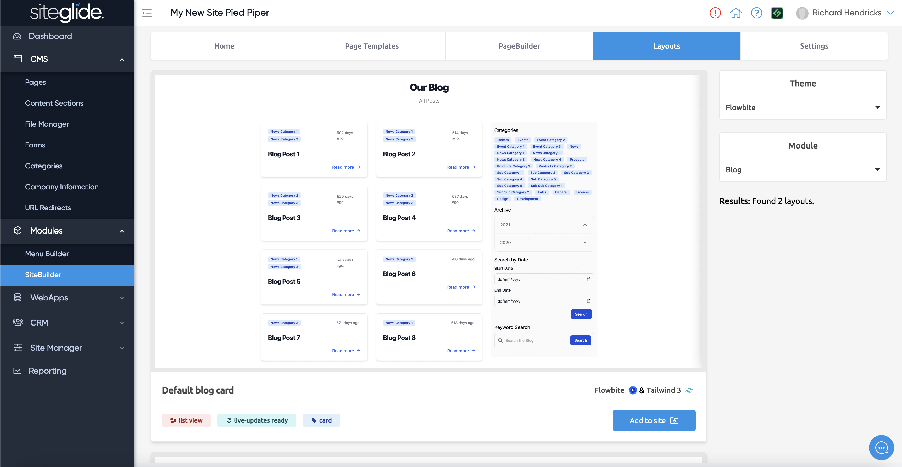
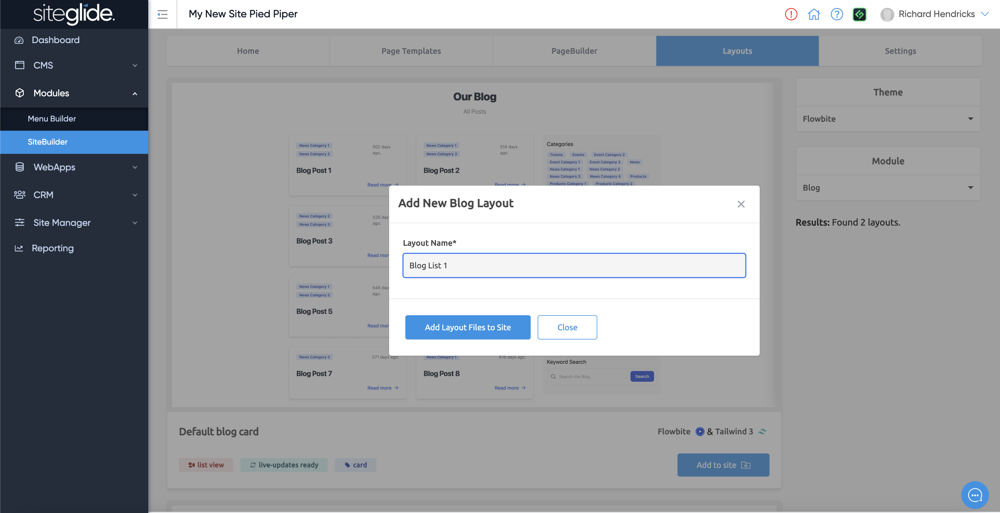
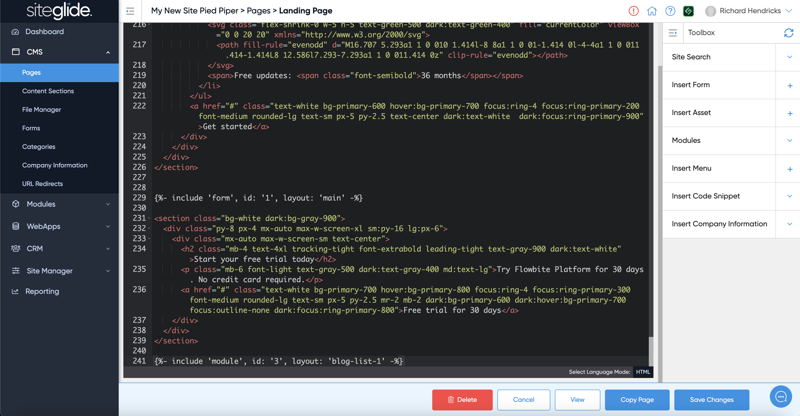
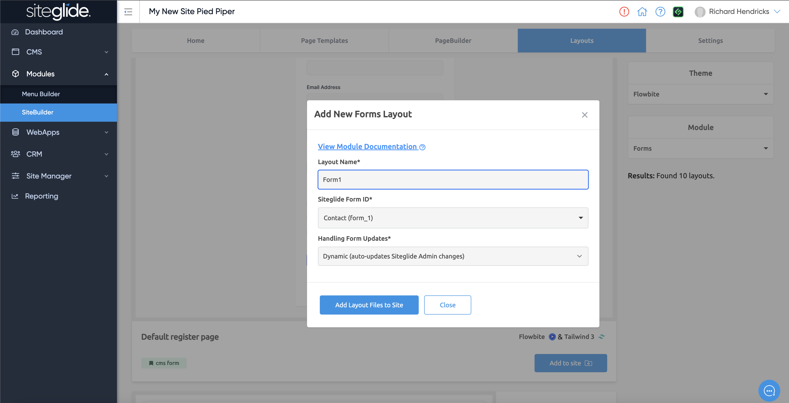

# 🏗️ Installing Dynamic Layouts


Looking for Static Layouts? They don't need to be installed, see: [static-layouts.md](about-sitebuilder/static-layouts.md "mention")


## Modules and Dynamic Layouts 

Once you've installed a Page Template, the other tabs will be available including the Layouts tab. Here you can toggle the Module on the right hand side and view all the different dynamic layouts available.

<figure><figcaption></figcaption></figure>

When you find a layout you want to use just click Add to Site, in the modal you will need to give the layout a name and there might be some additional settings to complete depending on the Module:

<figure><figcaption></figcaption></figure>

Once installed you can copy the include code that you just insert into your chosen HTML page.

<figure><figcaption></figcaption></figure>

You can insert it via CLI or via the Admin. Simply paste in where you want it to display:

<figure><figcaption></figcaption></figure>

## Dynamic Form Layouts

A really powerful part of SiteBuilder is the Dynamic Form Layouts that automatically update to reflect any changes to forms. For example you could add or edit fields in the form and the layout will update automatically!

<figure><figcaption></figcaption></figure>

More information on Form Layout options with SiteBuilder:


[static-and-dynamic-form-layouts.md](layouts/about-layouts/static-and-dynamic-form-layouts.md)


More info on Dynamic Layouts:


[dynamic-layouts-in-sitebuilder.md](layouts/about-layouts/dynamic-layouts-in-sitebuilder.md)


## Next Steps:

Want to add more Modules to your site?


[install-and-manage-modules.md](../../portal/sites/install-and-manage-modules.md)


Want to edit the Module Layouts themselves? We recommend doing this via CLI but you can also do it in Admin:

