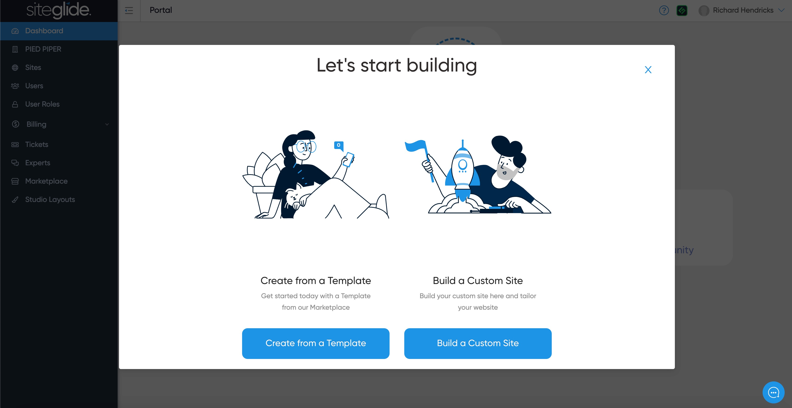

# 📋 Create Site From Template

From the Siteglide Portal on either the Dashboard page or the Sites page you should see a button to create a new site. It will open a modal to select either a Template or Custom Site.

<figure><figcaption></figcaption></figure>

## Step 1: Select a Template

This will take you to the Marketplace where you can select a category of templates. You can choose between all of our Flowbite layout templates or a couple of Bootstrap 5 options. It's recommended to use Flowbite, especially if you're familiar with Tailwind.

<figure><figcaption></figcaption></figure>

## Step 2: Choose the Appropriate Template

We recommend starting with the Landing Page or the Marketing Site Template. Choose the Marketing Site if you want to see more Siteglide functionality or the Landing Page if you'd rather just learn the basics first.

<figure><figcaption></figcaption></figure>

## Step 3: Create the Site

Finally, give your site a name and click 'Create Site'.

<figure><figcaption></figcaption></figure>

And that's it! You've successfully created a new site, you will need to wait for it to be ready to use. You will receive an email when it's done but can also find it under the Sites area:

<figure><figcaption>
Once you get the email confirming it's ready you will need to refresh this page or click the link from the email
</figcaption></figure>

## Next Steps:

Continue with our Quickstart guide?


[quickstart-sitebuilder.md](../quickstart-sitebuilder.md)

