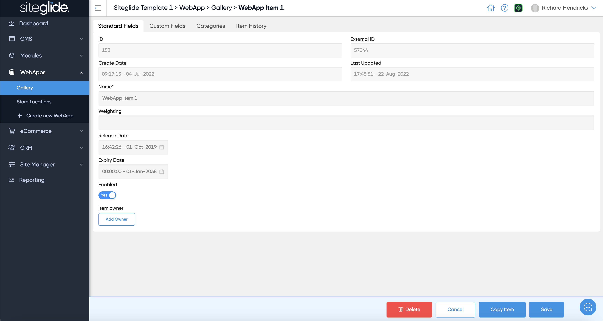
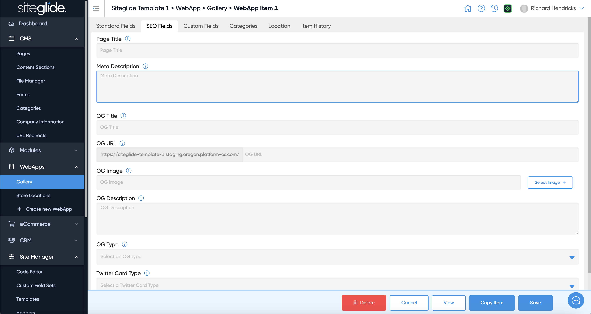
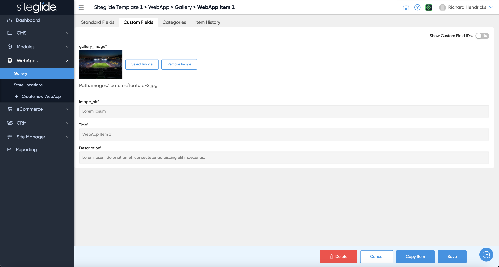
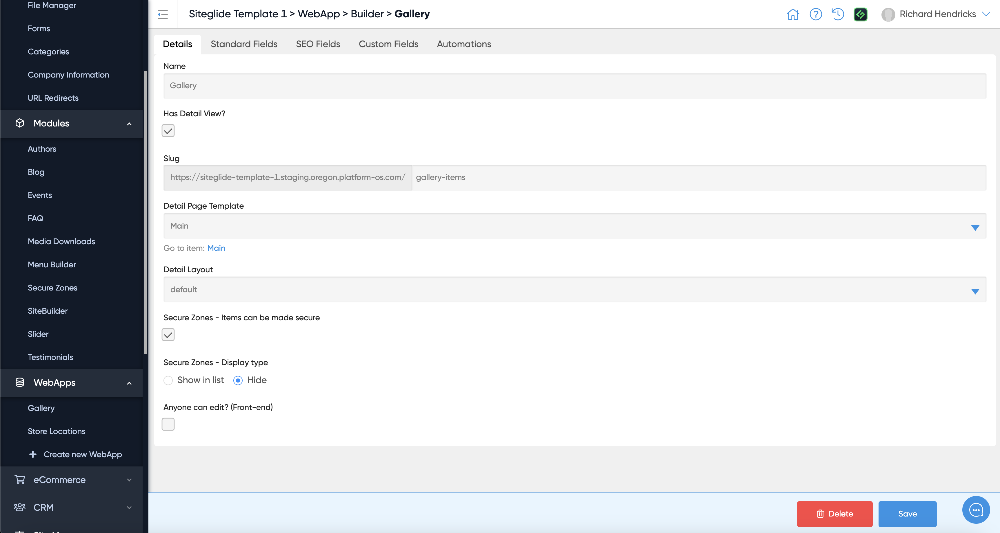
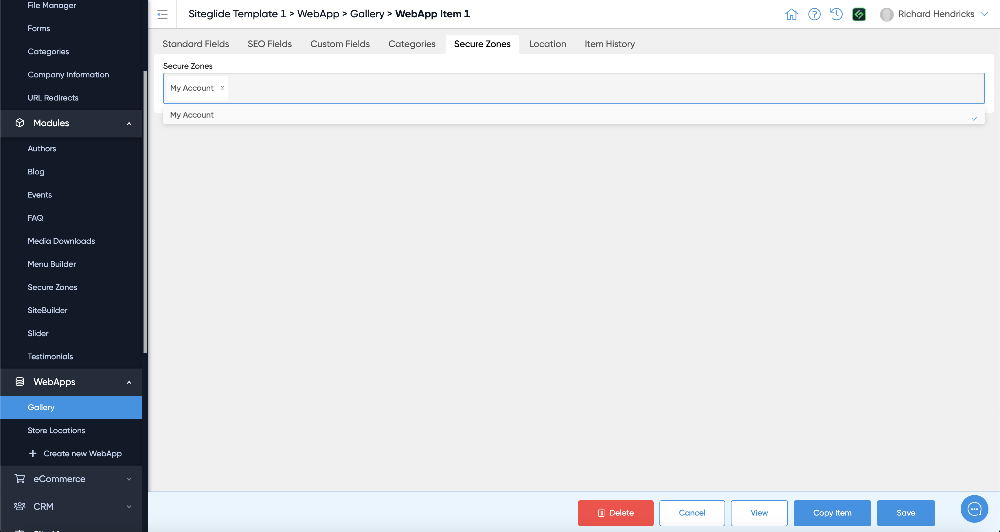
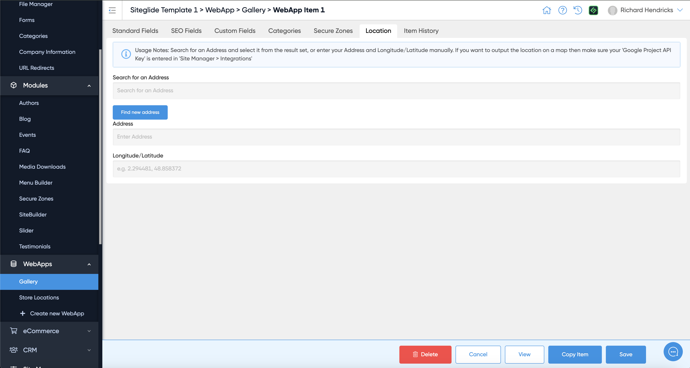

# 📋 Create WebApp Items

Once we’ve created our WebApp, it’s time to start creating items. This enables us to add services, recipes, store locations, images for our gallery and so much more to our site.

## Creating And Editing Items 

You can create unlimited items without writing any code, simply fill in the fields.

<figure><figcaption></figcaption></figure>

### Standard Fields 

These fields are the same across all WebApps and include the following:

* **ID / External ID** - Unique identifiers for each item, these appear when you have created and saved a new item and they cannot be edited.
* **Name** - Name of the WebApp item displayed in Admin and front-end
* **Item Slug** - (if you’ve enabled detail view within the WebApp structure) - URL for this item
* **Weighting** - Create a sort order of your choice
* **Release Date** - (in your timezone, outputs in UTC) - Choose a date for this item to be released
* **Expiry Date** - (in your timezone, outputs in UTC) - Choose a date for this item to expire
* **Enabled -** Choose to enable or disable this item
* **Item Owner** - Choose a user from your CRM to own this item

### SEO Settings 

Navigate to the next tab along, this is called "SEO"


If the SEO tab isn't showing it's because this WebApp doesn't have a Detail View.


SEO and Open Graph fields are the same across all WebApps and help to enhance your items and your website, achieving higher rankings.

These fields include:

* **Page Title -** Choose a title for this item
* **Meta Description -** (with an advised character length between 50-160) - Write a relevant meta description for this item
* **OG Title -** Choose an Open Graph title for this item
* **OG URL -** Choose an Open Graph URL for this item
* **OG Image -** Choose an Open Graph image for this item
* **OG Description -** Write a relevant Open Graph description for this item
* **OG Type** - Choose a type - article, book, profile, or website
* **Twitter Card Type** - Choose a type - app, player, summary, or summary_large_image - This is required for sharing this item on Twitter. For more information on Twitter Card Types, see [here](https://developer.twitter.com/en/docs/twitter-for-websites/cards/overview/abouts-cards)

<figure><figcaption></figcaption></figure>

### Custom Fields 

Navigate to the third tab along, this is called "Custom Fields".

Any custom fields added to your WebApp will show here for you to utilise.These can be filled in, if required, or left blank for later editing.

You can also toggle to show the custom field IDs; these can come in handy for outputting in layouts. You can instead choose to output the quick liquid provided from the dropdown in Code Editor.

<figure><figcaption></figcaption></figure>

### Adding Items to Categories 

Navigate to the fourth tab along, this is called "Categories".

With a list of available Categories, you can open top levels to show the children categories.

You can choose to add an item to any parent or child category.

**No categories showing?** Use ‘Manage Categories’: where you can create, edit and remove any.

**Find out more:** [Create a Category](/cms/categories/quickstart-categories.md)

<figure><figcaption></figcaption></figure>

***

### Securing Items 

Navigate to the fifth tab along, this is called "Secure Zones".


If the Secure Zones tab isn't showing it's because making items secure has not been enabled in the WebApp settings.


<figure><figcaption></figcaption></figure>

With Secure Zone options set up in your WebApp Builder, you can use the dropdown to add any existing secure zones on your site to this item.

<figure><figcaption></figcaption></figure>

Alternatively, backspace or “x” can remove any unwanted secure zones.

If no Secure Zones are available to add, you can create some:


[secure-zones](../../modules/core-modules/secure-zones/)


***

### Adding A Location 

Navigate to the sixth tab along, this is called "Location".

Using “Search for an Address” to find one, manually enter an “Address” or use “Longitude/Latitude” coordinates for GeoJSON, you can enter one location to be added to this item.

For example, this could be a Services WebApp with training locations, or Galleries showcasing hot vacation spots.

This can be shown on the front-end as a list, or in a map with drop pins.


[searching-by-location.md](../layouts/searching-by-location.md)


<figure><figcaption></figcaption></figure>

### Item History 

Navigate to the seventh tab along, this is called "Item History".

Here, you can view and restore different versions of this WebApp item from the last 7 days.

You can view when this version was created, by who, what action was taken, and a choice to view more information about this change and rollback.

<figure><figcaption></figcaption></figure>

### Copy Items 

Duplicating items allows you to easily replicate items across your Site and have an item with different URLs.

Once you have one item set up, you can duplicate this many times to create the number of items you need or duplicate once to set up a similar item without manually creating these.

You can do this by clicking ‘Copy item’ at the bottom of any item.

<figure><figcaption></figcaption></figure>

## &#x20;
