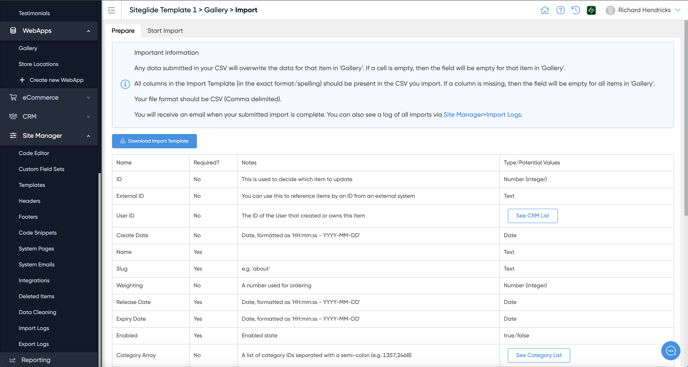
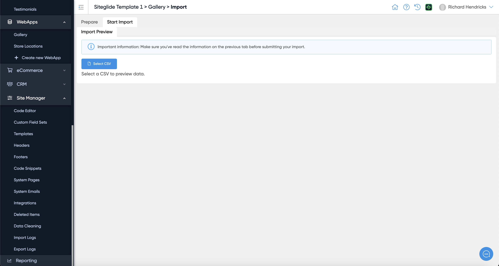
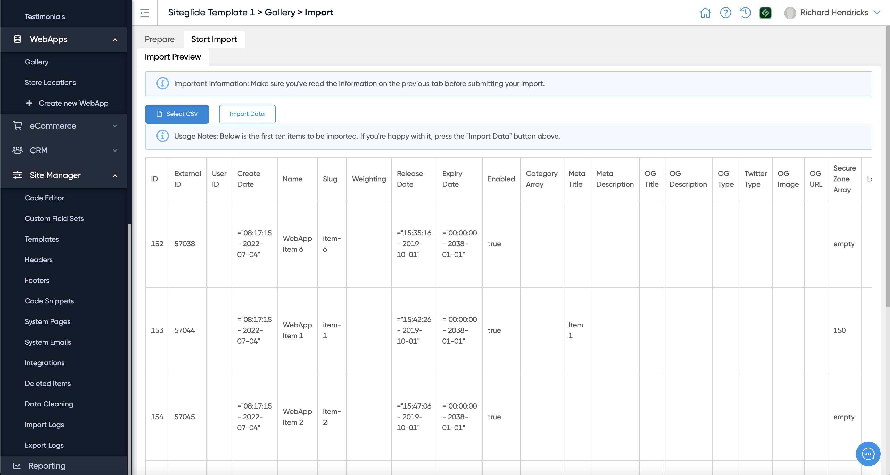
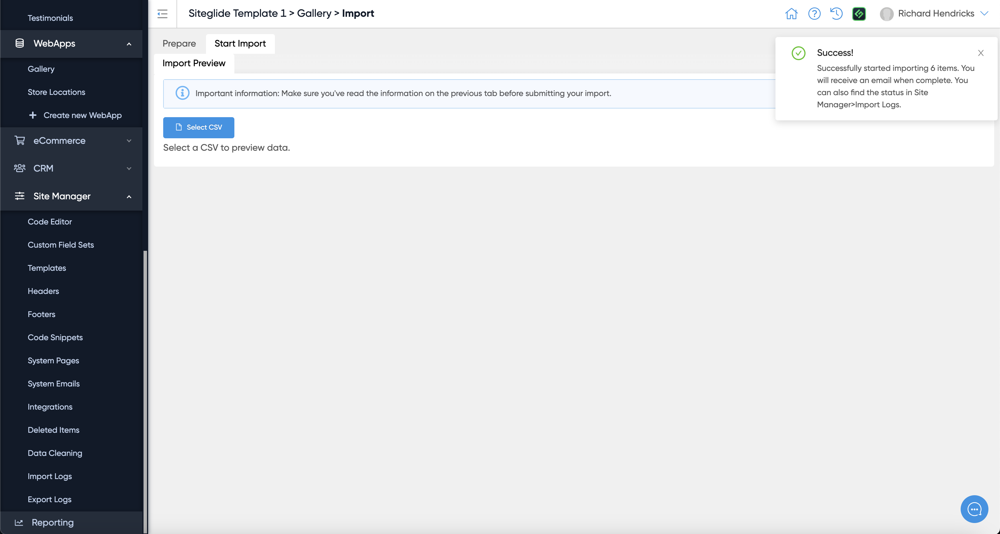
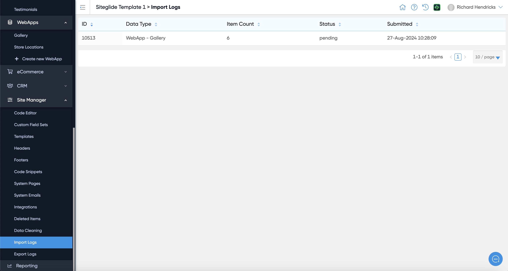

# 📋 Importing and Exporting

## Import

Importing CSVs is great for migrating items over from other sites to Siteglide; creating new items or editing existing items in bulk.

From your list of items, you can “Import” to “Download Import Template” , which contains essential columns for you to begin populating with data; alternatively, looking at this template preview in admin will show you which columns are required, and more information about each column to help you populate correctly.

<figure><figcaption></figcaption></figure>

“Start Import” to “Select CSV” and begin importing your items.

<figure><figcaption></figcaption></figure>

It will show a preview of the items and the structure:

<figure><figcaption></figcaption></figure>

Click Import Data once happy. A success or error message will appear in the top-right hand corner, and you will receive an email of the success or failure of each import.

<figure><figcaption></figcaption></figure>

If an import fails, you can head to Site Manager > Import Logs to learn more about this failure.

<figure><figcaption></figcaption></figure>

## Export

Exporting CSVs enables you to manage and edit all existing items (leaving the ID column as it is); or export an example item to help you import items correctly.

From your list of items, you can “Export” to download a CSV of all of your existing items for this WebApp. This will be processed in the background and you will receive an email of the success or failure of this export.

<figure><figcaption></figcaption></figure>

Success or fail, you can head to Site Manager > Export Logs to download this CSV or learn more about this failure.

aa
