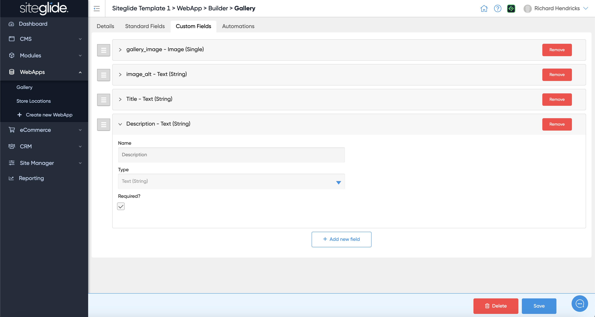
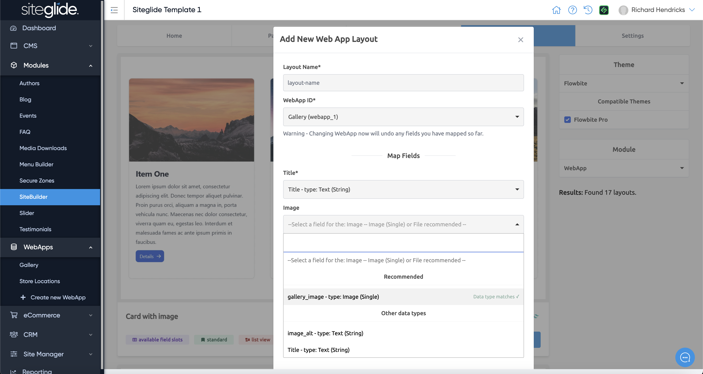
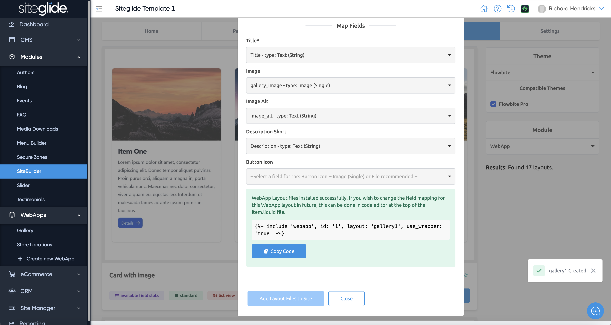
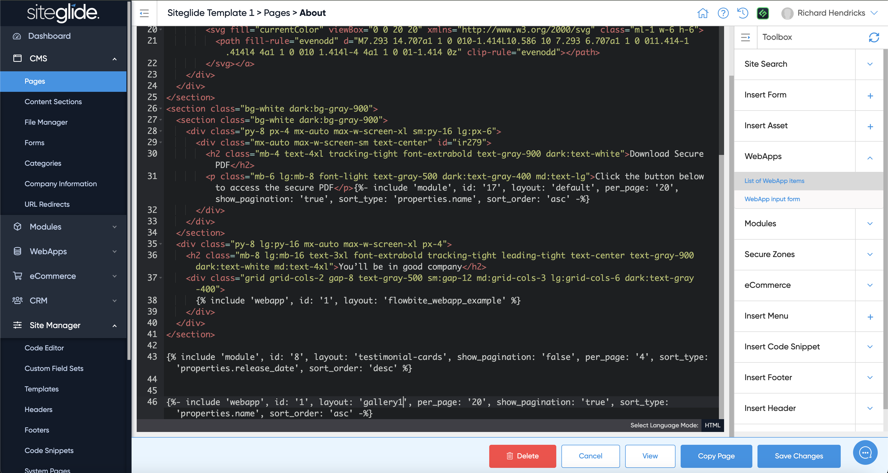
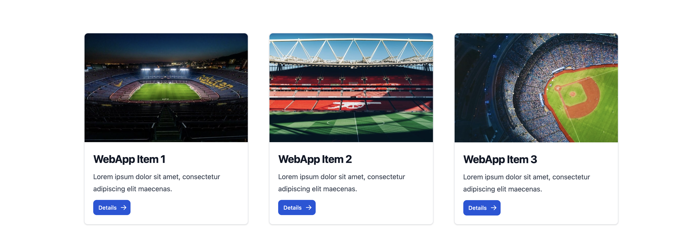

# 🚀 Quickstart: WebApps

## Step 1: Create a WebApp or Edit an Existing

Create a New WebApp from the left menu or if others already exist you can edit them:

<figure><figcaption></figcaption></figure>

## Step 2: Add or Edit any Custom Fields

<figure><figcaption></figcaption></figure>

## Step 3: Add or Edit Items

You can create and edit items from the WebApp in the UI:

<figure><figcaption></figcaption></figure>

You will see the custom fields you create in the setup stage and can fill in the content:

<figure><figcaption></figcaption></figure>

Full details here:


[create-webapp-items.md](items/create-webapp-items.md)


## Step 3: Customise the Layout

You can edit the default layouts or create new ones via CLI and Code Editor but we strongly recommend using SiteBuilder.&#x20;

Simply navigate to the SiteBuilder Module, click Layouts, choose WebApp from the Module dropdown and find a layout you want to use:

<figure><figcaption></figcaption></figure>

Map the Webapp Fields to the Layout Fields:

<figure><figcaption></figcaption></figure>

Then copy the Liquid include so you can insert it on a page:

<figure><figcaption></figcaption></figure>

Navigate to the page you want to output the WebApp List View onto and paste (or use Toolbox):

<figure><figcaption></figcaption></figure>

## Step 5: View the Items on the Page

You can then navigate to the page and see the items with the Layout you setup:

<figure><figcaption></figcaption></figure>
